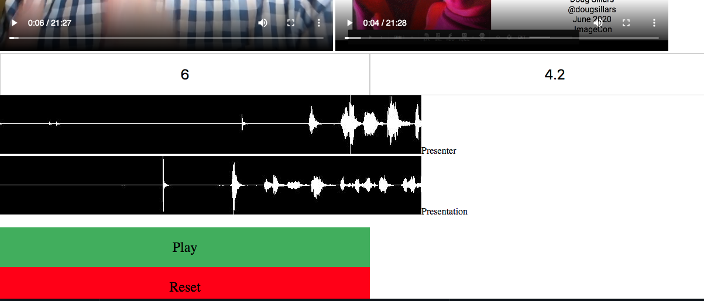
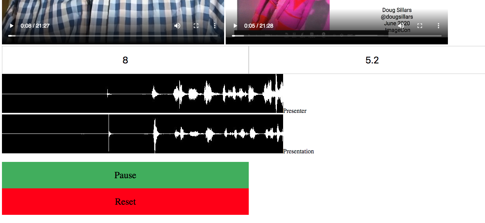

# ConferenceVideo Creator

With the websites in this reporsitory, you can create high quality conference videos for for distribution.  Use these for your next online conference, or use them to post-process the videos from your live event for later distribution.  The videos are then available on Cloudinary - allowing you to host them on your conference website.

## The Process

### Build the Layout

The layout describes how you will arrange the video of the speaker and the slides on your custom backdrop.  You'll probably only needto do this once per conferece (keeping a similar layout across all talks).

1. Create the layout of your conference talk.  To do this, you'll need your conference "backdrop", and 2 sample images: a presenter and a sample slide uploaded to your Cloudinary Cloud.

### Process a video

1. Record a video of the speaker and a screen capture of the slides at the same time.  IN the examples below, I simply used my cell phone to record my video, and I used QuickTime on my Mac for the screen recording.

2. Upload these videos to Cloudinary.  NOTE: These files are likely very large, you will want to have the maximum upload size increased on your account to do this.

 a. If you wish to have captions, upload one of the videos with the appropriate Cloudinary add-on for captions.
 
3. When you record 2 videos, it is unlikely that they will start precicly at the same time.  This means that the speaker will start talking at different timestamps on each video.  In order to sync these, there are two tools.  The first tool is the [Find Start Time](startTime.html).  For ths url, add the parameter ?url={videoUrl} to load one of your videos.  You can then press play, and use the forward/backward buttons to find the approximate start of the video (this can be approcimate to +-2-3 seconds).  Do this for each video (presenter and presentation) and record the start values.
4. Now that we know the approximate start times of the video, we will want to sync the videos very closely. Use the [Sync Audio ](syncTime.html) page to do this. Append the url with 4 parameters url1, startTime1, url2, startTime2, where the StartTimes are the values in step 3.  For example: start1=6&start2=4.2&url1=https://res.cloudinary.com/dougsillars/video/upload/v1589960426/camera.mp4&url2=https://res.cloudinary.com/dougsillars/video/upload/v1589960587/imagecon_video.mov - video 1 will start at time = 6, and video 2 will start at time 4.2.
5. A Page will load with 2 videos, 2 audio wavforms of the video (10 seconds around the start time), and 2 buttons: 

6. Our goal is to get the two videos to start at *about* the same time - say within 100ms of each other. In general, if a slide changes 100ms off from the audio track, it does not effect the overall presentation.  The videos are set to begin playback at the "start time" found in step 3.  In the screenshot above, we can see that the waveforms do not match - indicating that the audio is off.  Press play, and both videos start - you can hear the offset.  Adjust the values in the input boxes to change the video start times.  Then press "reset" to reset the start points and generate 2 new waveforms.  Keep iterating until the 2 videos very nearly overlap: both visually with the waveform and aurally by pressuing play.  Record your 2 new start times.

7. Generate your completed. Use the Create Video webpage to configure and upload the final video. (this is still under construction and not part of the repo.  However, two sample NodeJS files are here that create the final videos.  The presentation_test.js creates a 6 second version of the video to test before generating the full talk.  If you are happy with those results - continue with the full presentation.js to create the final video.  This file also uses the presenter video to create a transcript and VTT file (which will have incorrect timings).

The JSON response from 7 will have the final url of your presentation. For example, here is a simple talk I created on a Dr. Suess book:
https://res.cloudinary.com/dougsillars/video/upload/w_1920/l_ImgCon2020/fl_layer_apply/l_video:fish_preso,so_7.9/g_north_west,x_550,y_180,g_north_west,fl_layer_apply/l_video:presenter,so_11,c_fill,w_400,h_400/g_north_west,x_50,y_400,fl_layer_apply/fish_preso.mp4

